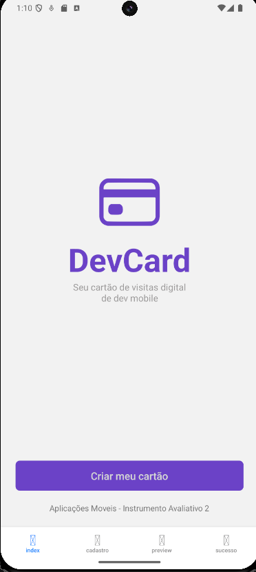
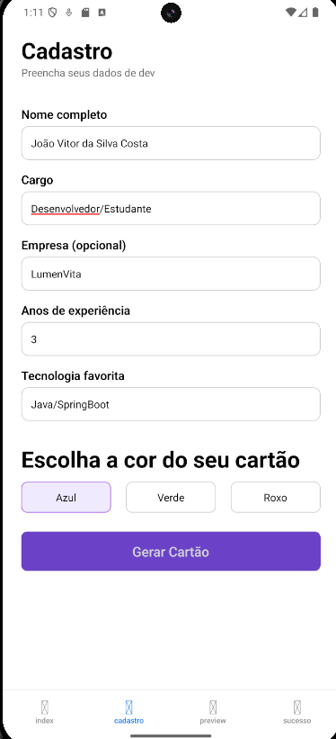
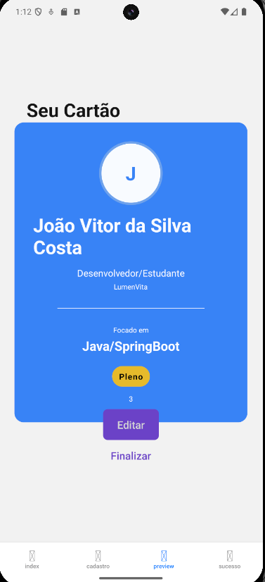
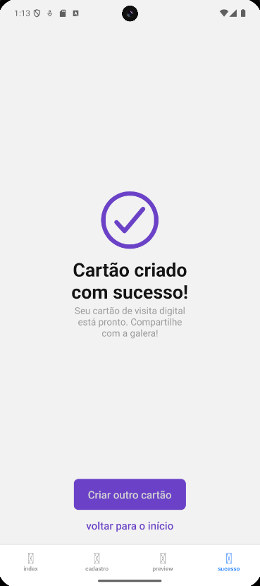

# Aplicações Móveis 📱

Repositório dedicado ao armazenamento de projetos, exercícios e atividades práticas desenvolvidos durante as aulas de Desenvolvimento de Aplicações Móveis.

---

## 🃏 Projeto Destaque: DevCard (Atividade Prática IA2.1)

O **DevCard** é um gerador de cartão de visita digital para desenvolvedores mobile. O objetivo principal do projeto foi consolidar os conceitos de manipulação de estados (`useState`), validações de formulários, renderização condicional baseada em regras de negócio e navegação robusta utilizando o **Expo Router**.

## 📸 Demonstração das Telas

<p align="center">
  
  
  
  
</p>

### 🚀 Funcionalidades e Regras de Negócio

O app foi construído seguindo um fluxo estrito de 4 telas integradas:

1. **Boas-vindas (`index.tsx`):** Ponto de partida que introduz o usuário ao ecossistema do app.
2. **Cadastro (`cadastro.tsx`):** Formulário inteligente com os seguintes critérios:
   * **Validação de Campos:** O nome exige mais de 3 caracteres; cargo, tecnologia e cor são obrigatórios; os anos de experiência devem ser um número maior que zero.
   * **Campos Opcionais:** A empresa pode ficar em branco sem quebrar o fluxo.
   * **Seleção Dinâmica de Cor:** Estado atrelado a botões customizados para definir a identidade visual do cartão.
3. **Preview do Cartão (`preview.tsx`):** Onde a lógica do app processa os dados recebidos via parâmetros locais (`useLocalSearchParams`):
   * **Avatar Dinâmico:** Captura automaticamente a primeira letra do nome do usuário e a renderiza em caixa alta dentro do avatar.
   * **Lógica Condicional de Nível (Badges):**
     * `0 a 2 anos` de experiência ➡️ Nível **Júnior**
     * `3 a 5 anos` de experiência ➡️ Nível **Pleno**
     * `6 ou mais anos` de experiência ➡️ Nível **Sênior**
   * **Estilização Dinâmica:** O componente `<CardContainer>` recebe a cor selecionada no cadastro via props e altera o `backgroundColor` em tempo de execução através de um array de estilos combinados.
   * **Navegação Inteligente:** O botão "Editar" utiliza `router.back()` para retornar mantendo os dados salvos no estado anterior. O botão "Finalizar" utiliza `router.replace()` para limpar a pilha de navegação.
4. **Sucesso (`sucesso.tsx`):** Tela de conclusão que encerra o fluxo e permite reiniciar o processo limpando o histórico.

---

## 🛠️ Tecnologias Utilizadas

* **React Native** (Interface declarativa e componentes nativos)
* **Expo / Expo Router** (Framework e roteamento baseado em arquivos)
* **TypeScript** (Tipagem estática para maior segurança do código)
* **Flexbox / StyleSheet** (Construção de layouts responsivos e modulares)

---

## 📦 Como Executar o Projeto DevCard

Certifique-se de ter o [Node.js](https://nodejs.org/) instalado em sua máquina.

1. Clone o repositório:
   ```bash
   git clone [https://github.com/JhonW67/aplicacoes-moveis.git](https://github.com/JhonW67/aplicacoes-moveis.git)

2. Navegue até a pasta do projeto DevCard:
    ```bash
    cd aplicacoes-moveis/IA2/DevCard

3. Instale as dependências:
    ```bash
    npm install
4. Inicie o servidor do Expo para Android:
    ```bash
    npm run android